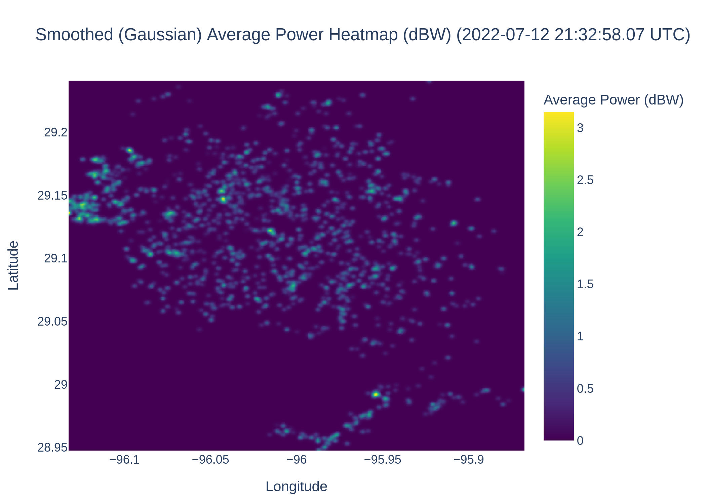
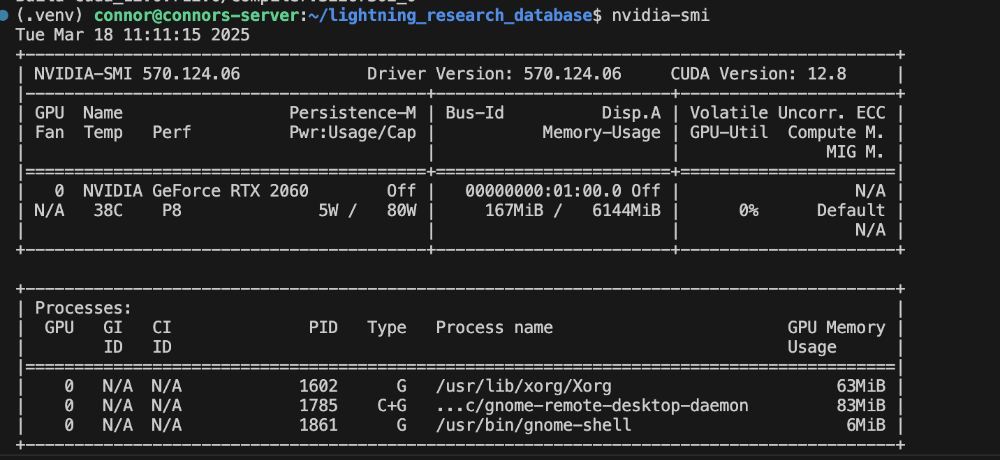
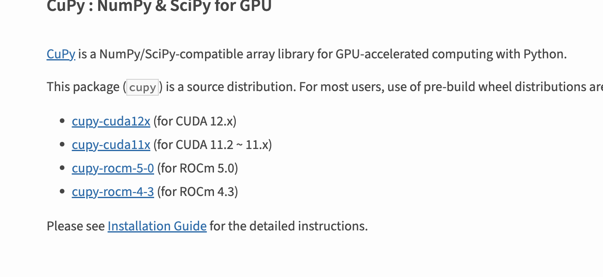
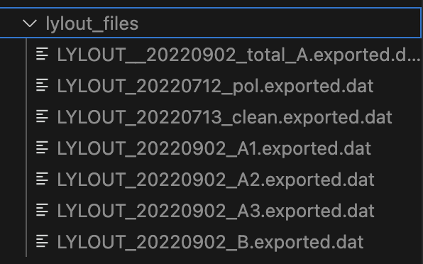

# Connor's Lightning Parser Program



This library extracts LYLOUT data, store it into a lightning database, and processes millions of datapoints in the database to a reasonably fast and optimized speed. This project is meant to be a framework for applications to implement and parse data more appropriately.

Assuming the following specs (tested on a laptop with Ubuntu 22.04):
 - 16 GB DDR4 RAM (Mobile)
 - RTX 2060 Mobile (6GB)
 - Intel i7-10750H (6 Cores -> 12 Threads)
 - Python 3.12.3 (Regular version/Not conda)

One million datapoints should take roughly 7 minutes. Running the same exact parameters again would take 5-10 seconds due to caching into "result_cache.pkl".

## Start

### Getting Started

1. Git clone the project
`git clone https://github.com/CorniiDog/lightning_research_database.git`

2. Open the project in VSCode

3. Create a virtual environment (`cmd+shift+p` for MACOS or `ctrl+shift+p` for Windows) -> "Python:Select Interpreter" -> ".venv" and then select a specified version.

4. Either check the box for "requirements.txt" before continuing, or after re-opening the terminal to do `pip install -r requirements.txt`

### Note that the library uses CUDA

>1. Install your designated CUDA: https://developer.nvidia.com/cuda-downloads
>
>2. Determine CUDA version by typing into terminal: `nvidia-smi`
>
>
>
>3. Install your designated cupy version: https://pypi.org/project/cupy/
>
>
>
> As My `nvidia-smi` stated that my CUDA version was 12.8, I would do `pip install cupy-cuda12x`

### To Run the project

1. Drag and drop your LYLOUT text files into "lylout_files" directory.



2. Modify the filters in "main.py":
```py
start_time = datetime.datetime(
    2022, 7, 12, 0, 0, tzinfo=datetime.timezone.utc
).timestamp()
end_time = datetime.datetime(
    2022, 7, 12, 23, 0, tzinfo=datetime.timezone.utc
).timestamp()

# Build filter list for time_unix boundaries.
filters = [
    ("time_unix", ">=", start_time),
    ("time_unix", "<=", end_time),
    ("reduced_chi2", "<", 2.0),
    ("num_stations", ">=", 7),
    ("alt", "<=", 17000),  # 20 km = 20000m
    ("alt", ">", 0),  # Above ground
    ("power_db", ">", -4),  # dBW
    ("power_db", "<", 50),  # dBW
]
```

3. Modify parameters
```py
params = {
    "max_lightning_dist": 50000,  # meters
    "max_lightning_speed": 299792.458,  # m/s
    "min_lightning_speed": 0,  # m/s
    "min_lightning_points": 300,  # The minimum number of points to pass the minimum amount
    "max_lightning_time_threshold": 0.15,  # seconds between points
}

lightning_bucketer.USE_CACHE = (
    True  # Generate cache of result to save time for future identical requests
)
```

4. Run with `python run main.py` and observe the new ".png" outputs and a "strikes" directory

> [!NOTE]
> Some individuals may upload a compressed LYLOUT file without adding a suggestive extension filename. Make sure that all LYLOUT files are able to be readable as a text file. If they are not, they are likely compressed, with or without the extension name. It is suggested to try to add the ".gz" extension at the end manually by renaming the file, and attempt to unzip it. If that is not successful, try adding ".zip" and attempt to unzip.
>
>

> [!NOTE]
> When data is added to "lylout_files", everything gets hashed and recorded into "lylout_db.db". This ".db" file is a SQL database that stores all historical lightning strikes. If the database is becoming too large, you can simply delete the "lylout_db.db" file.
>
> To relocate the database file (for example, to an external hard drive), you can change the path via:
>
> ```py
> database_parser.parse_lylout(file_path, DB_PATH="new/path/to/database.db")
> ```

