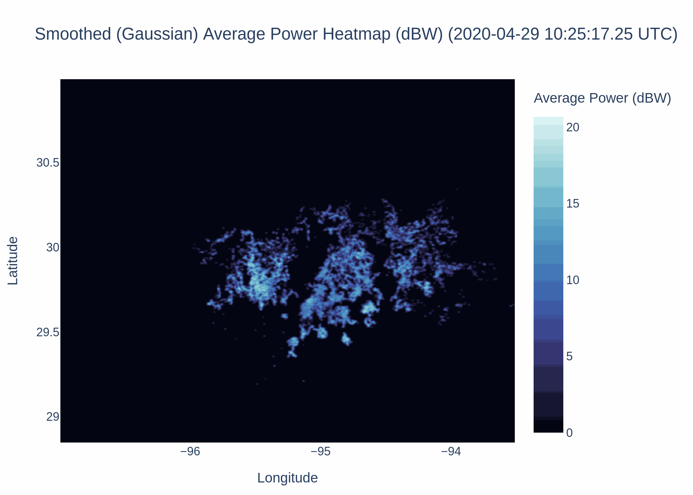
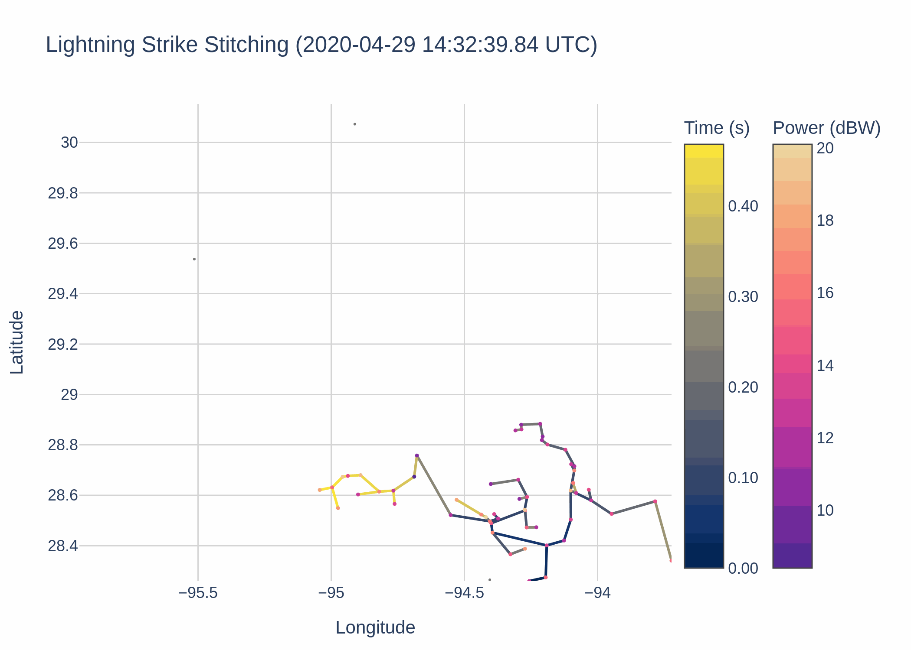

# Connor's Lightning Parser Program





This library extracts LYLOUT data, store it into a lightning database, and processes millions of datapoints in the database to a reasonably fast and optimized speed. This project is meant to be a framework for applications to implement and parse data more appropriately.

Assuming the following specs (tested on a laptop with Ubuntu 22.04):
 - 16 GB DDR4 RAM (Mobile)
 - RTX 2060 Mobile (6GB)
 - Intel i7-10750H (6 Cores -> 12 Threads)
 - Python 3.12.3 (Regular version/Not conda)

Three million datapoints should take roughly 4 minutes to process (excluding generating plots). Running the same exact parameters again would take 18-20 seconds due to caching.

## Start

### Getting Started

1. Git clone the project
`git clone https://github.com/CorniiDog/lightning_research_database.git`

2. Open the project in VSCode

3. Create a virtual environment (`cmd+shift+p` for MACOS or `ctrl+shift+p` for Windows) -> "Python:Select Interpreter" -> ".venv" and then select a specified version.

4. Either check the box for "requirements.txt" before continuing, or after re-opening the terminal to do `pip install -r requirements.txt`

### To Run the project

1. Drag and drop your LYLOUT text files into "lylout_files" directory.


2. Modify the filters in "main.py":
```py
start_time = datetime.datetime(
    2022, 7, 12, 0, 0, tzinfo=datetime.timezone.utc
).timestamp()
end_time = datetime.datetime(
    2022, 7, 12, 23, 0, tzinfo=datetime.timezone.utc
).timestamp()

# Build filter list for time_unix boundaries.
# Look at "List of headers" above for additional
# Filterings
filters = [
    ("time_unix", ">=", start_time),  # In unix
    ("time_unix", "<=", end_time),  # In unix
    ("reduced_chi2", "<", 2.0,),  # The chi^2 (reliability index) value to accept the data
    ("num_stations", ">=", 7),  # Number of stations that have visibly seen the strike
    ("alt", "<=", 18000),  # alt is in meters. Therefore 20 km = 20000m
    ("alt", ">", 0),  # Above ground
    ("power_db", ">", -4),  # In dBW
    ("power_db", "<", 50),  # In dBW
]
```

3. Modify parameters
```py
# Additional parameters that determines "What points make up a single lightning strike"
# They are explicitly defined
params = {
    # Creating an initial lightning strike
    "max_lightning_dist": 5000,  # Max distance between two points to determine it being involved in the same strike
    "max_lightning_speed": 299792.458,  # Max speed between two points in m/s (essentially dx/dt)
    "min_lightning_speed": 0,  # Min speed between two points in m/s (essentially dx/dt)
    "min_lightning_points": 300,  # The minimum number of points to pass the system as a "lightning strike"
    "max_lightning_time_threshold": 0.08,  # Max number of seconds between points 
    "max_lightning_duration": 20, # Max seconds that define an entire lightning strike. This is essentially a "time window" for all of the points to fill the region that determines a "lightning strike"

    # Combining intercepting lightning strike data filtering
    "combine_strikes_with_intercepting_times": True, # Set to true to ensure that strikes with intercepting times get combined. 
    "intercepting_times_extension_buffer": 0.15, # Number of seconds of additional overlap to allow an additional strike to be involved
    "intercepting_times_extension_max_distance": 150000 # The max distance between the start point of one lightning strike and the entirety of another lightning strike's points
}

lightning_bucketer.USE_CACHE = True  # Generate cache of result to save time for future identical (one-to-one exact) requests
```

4. Run with `python run main.py` and observe the new ".png" outputs and a "strikes" directory

> [!NOTE]
> Some individuals may upload a compressed LYLOUT file without adding a suggestive extension filename. Make sure that all LYLOUT files are able to be readable as a text file. If they are not, they are likely compressed, with or without the extension name. It is suggested to try to add the ".gz" extension at the end manually by renaming the file, and attempt to unzip it. If that is not successful, try adding ".zip" and attempt to unzip.
>
>

> [!NOTE]
> When data is added to "lylout_files", everything gets hashed and recorded into "lylout_db.db". This ".db" file is a SQL database that stores all historical lightning strikes. If the database is becoming too large, you can simply delete the "lylout_db.db" file.
>
> To relocate the database file (for example, to an external hard drive), you can change the path via:
>
> ```py
> database_parser.parse_lylout(file_path, DB_PATH="new/path/to/database.db")
> ```

